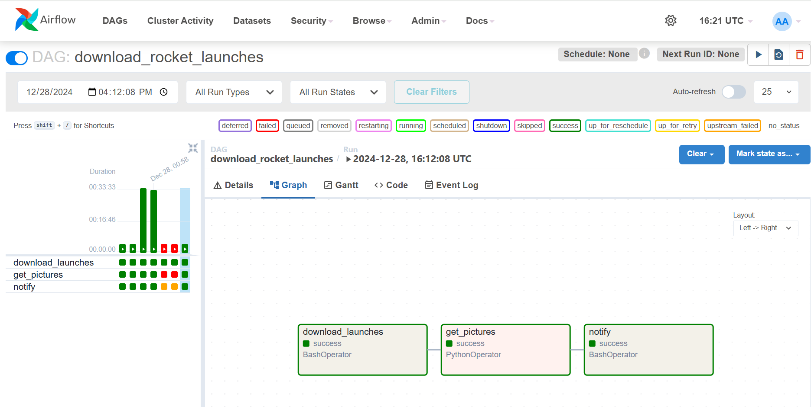

# Airflow-Rocket Launch Data Pipeline

This project implements an **Airflow DAG (Directed Acyclic Graph)** to automate the process of downloading, processing, and reporting on upcoming rocket launches. The pipeline fetches data from an external API, extracts relevant images, and provides a notification of the number of images downloaded.

## DAG



## Project Workflow

The DAG consists of the following tasks:

1. **Download Launches JSON**:
   - **Operator**: `BashOperator`
   - Downloads upcoming rocket launches data in JSON format from [The Space Devs Launches](https://ll.thespacedevs.com/2.0.0/launch/upcoming).
   - Saves the file as `/tmp/launches.json`.

2. **Download Rocket Images**:
   - **Operator**: `PythonOperator`
   - Extracts image URLs from the downloaded JSON file and downloads these images.
   - Stores the images in the `/opt/airflow/images` directory.
   - Handles exceptions for invalid URLs or connection errors, ensuring the pipeline is robust.

3. **Notify**:
   - **Operator**: `BashOperator`
   - Prints the total number of images downloaded to the `/opt/airflow/images` directory.

## File Descriptions

- **DAG File**: The code for the Airflow DAG, written in Python, defines the entire workflow for the pipeline.
- **launches.json**: A JSON file containing details of upcoming rocket launches, downloaded from the API.
- **Images Directory**: A directory where all the rocket launch images are stored.

## Technologies Used

- **Apache Airflow**: For defining and scheduling the DAG.
- **Python**: For writing custom tasks to process and download images.
- **Bash**: For executing shell commands in the pipeline.
- **curl**: For fetching data from the API.
- **Requests Library**: For handling HTTP requests to download images.

## Setup and Usage

1. Clone the repository and navigate to the project directory.
2. Ensure Apache Airflow is installed and configured on your system.
3. Place the DAG file in your Airflow `dags` directory.
4. Start Airflow and trigger the `download_rocket_launches` DAG:
   ```bash
   airflow dags trigger download_rocket_launches
